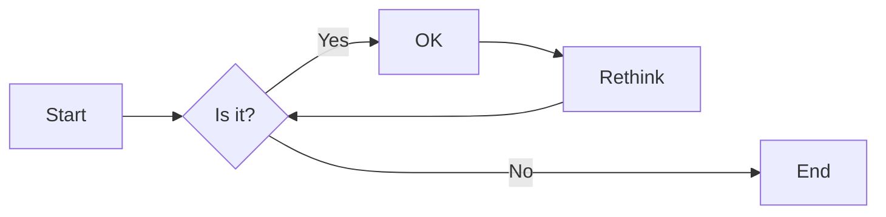
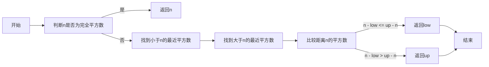
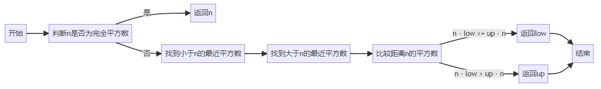
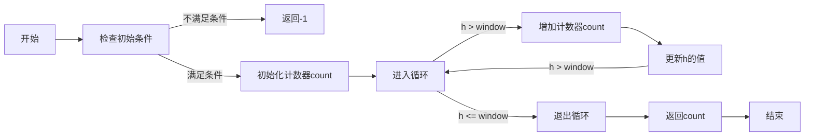
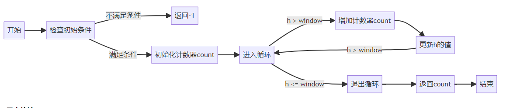
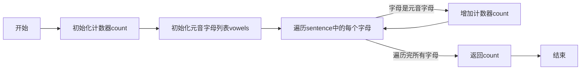
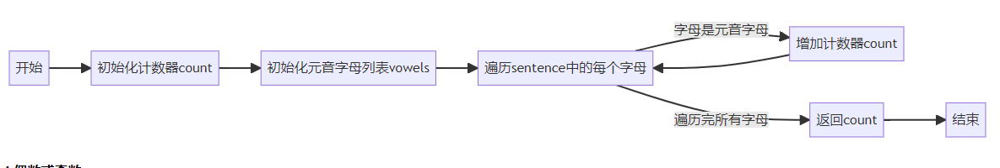

# 实验二 Python变量、简单数据类型

班级： 21计科3班

学号： 20210302302

姓名： 蒋俊杰

Github地址：<https://github.com/jiangjunjie666/python_study>

CodeWars地址：<https://www.codewars.com/users/jiangjunjie666>

---

## 实验目的

1. 使用VSCode编写和运行Python程序
2. 学习Python变量和简单数据类型

## 实验环境

1. Git
2. Python 3.10
3. VSCode
4. VSCode插件

## 实验内容和步骤

### 第一部分

实验环境的安装

1. 安装Python，从Python官网下载Python 3.10安装包，下载后直接点击可以安装：[Python官网地址](https://www.python.org/downloads/)
2. 为了在VSCode集成环境下编写和运行Python程序，安装下列VScode插件
   - Python
   - Python Environment Manager
   - Python Indent
   - Python Extended
   - Python Docstring Generator
   - Jupyter
   - indent-rainbow
   - Jinja

---

### 第二部分

Python变量、简单数据类型和列表简介

完成教材《Python编程从入门到实践》下列章节的练习：

- 第2章 变量和简单数据类型

---

### 第三部分

在[Codewars网站](https://www.codewars.com)注册账号，完成下列Kata挑战：

---

#### 第1题：求离整数n最近的平方数（Find Nearest square number）

难度：8kyu

你的任务是找到一个正整数n的最近的平方数
例如，如果n=111，那么nearest_sq(n)（nearestSq(n)）等于121，因为111比100（10的平方）更接近121（11的平方）。
如果n已经是完全平方（例如n=144，n=81，等等），你需要直接返回n。
代码提交地址
<https://www.codewars.com/kata/5a805d8cafa10f8b930005ba>

---

#### 第2题：弹跳的球（Bouncing Balls）

难度：6kyu

一个孩子在一栋高楼的第N层玩球。这层楼离地面的高度h是已知的。他把球从窗口扔出去。球弹了起来,  例如:弹到其高度的三分之二（弹力为0.66）。他的母亲从离地面w米的窗户向外看,母亲会看到球在她的窗前经过多少次（包括球下落和反弹的时候）？

一个有效的实验必须满足三个条件：

- 参数 "h"（米）必须大于0
- 参数 "bounce "必须大于0且小于1
- 参数 “window "必须小于h。

如果以上三个条件都满足，返回一个正整数，否则返回-1。
**注意:只有当反弹球的高度严格大于窗口参数时，才能看到球。**
代码提交地址
<https://www.codewars.com/kata/5544c7a5cb454edb3c000047/train/python>

---

#### 第3题： 元音统计(Vowel Count)

难度： 7kyu

返回给定字符串中元音的数量（计数）。对于这个Kata，我们将考虑a、e、i、o、u作为元音（但不包括y）。输入的字符串将只由小写字母和/或空格组成。

代码提交地址：
<https://www.codewars.com/kata/54ff3102c1bad923760001f3>

---

#### 第4题：偶数或者奇数（Even or Odd）

难度：8kyu

创建一个函数接收一个整数作为参数，当整数为偶数时返回”Even”当整数位奇数时返回”Odd”。
代码提交地址：
<https://www.codewars.com/kata/53da3dbb4a5168369a0000fe>

### 第四部分

使用Mermaid绘制程序流程图

安装Mermaid的VSCode插件：

- Markdown Preview Mermaid Support
- Mermaid Markdown Syntax Highlighting

使用Markdown语法绘制你的程序绘制程序流程图（至少一个），Markdown代码如下：


显示效果如下：



查看Mermaid流程图语法-->[点击这里](https://mermaid.js.org/syntax/flowchart.html)

使用Markdown编辑器（例如VScode）编写本次实验的实验报告，包括[实验过程与结果](#实验过程与结果)、[实验考查](#实验考查)和[实验总结](#实验总结)，并将其导出为 **PDF格式** 来提交。

## 实验过程与结果

请将实验过程与结果放在这里，包括：

- [第二部分 Python变量、简单数据类型和列表简介](#第二部分)

##### 2.1 简单消息

```python
str = 'hello world'
print(str)
```

##### 2.2 多条简单消息

```python
str = 'old message'
print(str)
str = 'new message'
print(str)
```

##### 2.3 个性化消息

```python
name = input("请输入你的name：")
print("hello " + name + ", would you like to learn some Python today?")
```

##### 2.4 调整名字的大小写

```python
name = "eric"
print("小写名字："+ name.lower())
print("大写名字："+ name.upper())
print("首字母大写："+ name.capitalize())
```

##### 2.5 名言1

```python
print("Albert Einstein once said,\"A person who never made a mistake never tried anything new.\"")
```

##### 2.6 名言2

```python
famous_name = 'Albert Einstein'
message = famous_name + ' once said,"A person who never made a mistake never tried anything new."'
print(message)
```

##### 2.7 删除人名中的空白

```python
name = '\n  Albert Einstein  \t'
# 删除头尾的空白符号
name = name.strip()
print(name)
```

##### 2.8 文件扩展名

```python
filename = 'python_notes.txt'
print(filename.removesuffix('.txt'))
```

##### 2.9 数字8

```python
print(3+5)
print(9-1)
print(2*4)
print(16/2)
```

##### 2.10 最喜欢的数

```python
like_num = 10
str = '我最喜欢的数是：' + str(like_num)
print(str)
```

- [第三部分 Codewars Kata挑战](#第三部分)

##### 1.离整数最近的平方数

```python
import math

def nearest_sq(n):
    # 如果 n 是完全平方数，直接返回 n
    if math.isqrt(n) ** 2 == n:
        return n
    
    # 找到最近的小于 n 的平方数
    low = math.isqrt(n) ** 2
    
    # 找到最近的大于 n 的平方数
    up = (math.isqrt(n) + 1) ** 2
    
    # 返回距离 n 最近的平方数
    if n - low <= up - n:
        return low
    else:
        return up
```

##### 流程图





##### 2.弹跳的球

```python
def bouncing_ball(h, bounce, window):
    if h <= 0 or bounce <= 0 or bounce >= 1 or window >= h:
        return -1
    
    count = 0
    while h > window:
        count += 1
        h *= bounce
        if h > window:
            count += 1
  
    return count

```

##### 流程图





##### 3.元音统计

```python
def get_count(sentence):
  count = 0
  vowels = ['a', 'e', 'i', 'o', 'u']
  for letter in sentence:d
    if letter in vowels:
      count += 1
  return count
```

##### 流程图





##### 4.偶数或奇数

```python
def even_or_odd(number):
    if(number % 2 == 0):
        return "Even"
    else:
        return "Odd"
```

## 实验考查

请使用自己的语言并使用尽量简短代码示例回答下面的问题，这些问题将在实验检查时用于提问和答辩以及实际的操作。

1. Python中的简单数据类型有那些？我们可以对这些数据类型做哪些操作？

整数（int）：表示整数值，例如 1、100、-5。
浮点数（float）：表示带有小数点的数值，例如 3.14、-0.5、2.0。
布尔值（bool）：表示真（True）或假（False）的值。
字符串（str）：表示字符序列，例如 'hello'、'123'。

我们可以对其进行下列的简单操作：

- 算术操作：例如加法、减法、乘法、除法、取余等。
- 比较操作：例如相等比较、不等比较、大于比较、小于比较等。
- 逻辑操作：例如与、或、非等逻辑运算。
- 赋值操作：将一个值赋给一个变量。
- 类型转换：例如将整数转换为浮点数、将字符串转换为整数等。
- 字符串操作：例如连接字符串、提取子字符串、替换字符串等。
- 类型检查：例如检查一个值是否为整数、浮点数、布尔值或字符串等。

2. 为什么说Python中的变量都是标签？

在Python中，变量被认为是标签而不是盒子。这是因为Python中的变量实际上是对内存中对象的引用，而不是存储数据的容器。

当你创建一个变量并将其赋值给某个值时，实际上是在给这个值分配一块内存，并将变量标签（引用）指向该内存地址。这意味着变量本身并不包含实际的数据，而只是指向数据的标签。

这种变量作为标签的方式有几个重要的影响：

动态类型：Python是一种动态类型语言，这意味着变量的类型是根据所引用的对象类型来确定的。你可以将同一个变量用于不同类型的对象，而无需事先声明变量的类型。

对象的可变性：当你将一个变量赋值给一个可变对象（如列表或字典）时，这个变量实际上是指向这个对象的引用。这意味着当你修改对象时，所有引用该对象的变量都会反映出这些修改。

内存管理：Python使用垃圾回收机制来管理内存。当一个对象没有任何变量引用时，垃圾回收机制会自动释放该对象所占用的内存空间。

这种变量作为标签的概念使得Python的变量赋值和传递更加灵活和高效。因此，可以说Python中的变量是标签而不是盒子。

3. 有哪些方法可以提高Python代码的可读性？

- 使用有意义的变量名：选择描述性和易于理解的变量名，以便读者可以快速理解变量的用途和含义。

- 缩进和格式化：使用一致的缩进和格式化风格，例如使用4个空格进行缩进，并在适当的位置添加空行和垂直对齐。

- 注释：在代码中添加注释来解释复杂的逻辑、算法或代码段的用途和工作原理。注释应该清晰明了，不仅仅是重复代码的功能。

- 函数和类的设计：将代码模块化为函数和类，每个函数和类应该只负责一个特定的任务或功能。合理划分代码可以提高代码的可读性和可维护性。

- 避免过长的代码行：尽量避免单行代码过长，建议将长行代码分为多行，并使用括号或反斜杠进行换行。

- 使用空格和空行：在适当的地方使用空格进行分隔，例如在操作符周围、逗号后面等。同时，在逻辑上相关的代码块之间使用空行进行分隔，以提高可读性。

- 使用命名约定：遵循Python的命名约定，例如使用小写字母和下划线来命名变量和函数，使用首字母大写的驼峰命名法来命名类。

- 避免魔法数值：避免在代码中使用硬编码的魔法数值，将其定义为常量或变量，并使用有意义的名称。

- 模块和导入的组织：合理组织代码文件和模块，将相关的功能放在一起，并使用清晰的导入语句来引入所需的模块。

## 实验总结

总结一下这次实验你学习和使用到的知识，例如：编程工具的使用、数据结构、程序语言的语法、算法、编程技巧、编程思想。

本次实验，我学习了Python语言的基本语法，包括变量、数据类型、条件语句、循环语句、函数、模块、包等。对python语言有了初步的了解，以及其语法和简单的数据类型等都有了初步了理解。
