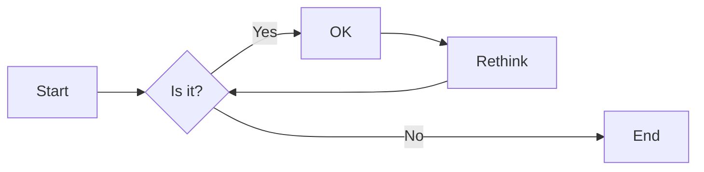
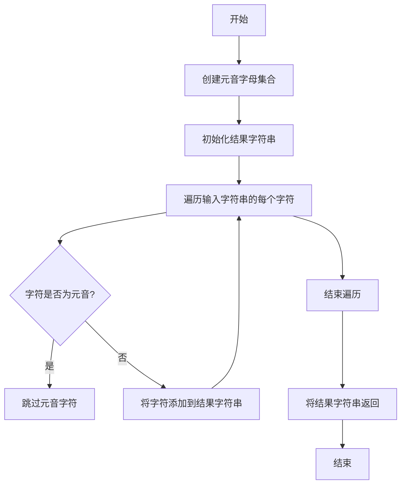

# 实验三 Python列表

班级： 21计科3

学号： 20210302302

姓名： 蒋俊杰

Github地址：<https://github.com/jiangjunjie666/python_study>

CodeWars地址：<https://www.codewars.com/users/jiangjunjie666>

---

## 实验目的

1. 学习Python的简单使用和列表操作
2. 学习Python中的if语句

## 实验环境

1. Git
2. Python 3.10
3. VSCode
4. VSCode插件

## 实验内容和步骤

### 第一部分

Python列表操作

完成教材《Python编程从入门到实践》下列章节的练习：

- 第3章 列表简介
- 第4章 操作列表
- 第5章 if语句

---

### 第二部分

在[Codewars网站](https://www.codewars.com)注册账号，完成下列Kata挑战：

---

#### 第一题：3和5的倍数（Multiples of 3 or 5）

难度： 6kyu

如果我们列出所有低于 10 的 3 或 5 倍数的自然数，我们得到 3、5、6 和 9。这些数的总和为 23. 完成一个函数，使其返回小于某个整数的所有是3 或 5 的倍数的数的总和。此外，如果数字为负数，则返回 0。

注意：如果一个数同时是3和5的倍数，应该只被算一次。

**提示：首先使用列表解析得到一个列表，元素全部是3或者5的倍数。
使用sum函数可以获取这个列表所有元素的和.**

代码提交地址：
<https://www.codewars.com/kata/514b92a657cdc65150000006>

---

#### 第二题： 重复字符的编码器（Duplicate Encoder）

难度： 6kyu

本练习的目的是将一个字符串转换为一个新的字符串，如果新字符串中的每个字符在原字符串中只出现一次，则为"("，如果该字符在原字符串中出现多次，则为")"。在判断一个字符是否是重复的时候，请忽略大写字母。

例如:

```python
"din"      =>  "((("
"recede"   =>  "()()()"
"Success"  =>  ")())())"
"(( @"     =>  "))(("
```

代码提交地址:
<https://www.codewars.com/kata/54b42f9314d9229fd6000d9c>

---

#### 第三题：括号匹配（Valid Braces）

难度：6kyu

写一个函数，接收一串括号，并确定括号的顺序是否有效。如果字符串是有效的，它应该返回True，如果是无效的，它应该返回False。
例如：

```python
"(){}[]" => True 
"([{}])" => True
 "(}" => False
 "[(])" => False 
"[({})](]" => False
```

**提示：
python中没有内置堆栈数据结构，可以直接使用`list`来作为堆栈，其中`append`方法用于入栈，`pop`方法可以出栈。**

代码提交地址
<https://www.codewars.com/kata/5277c8a221e209d3f6000b56>

---

#### 第四题： 从随机三元组中恢复秘密字符串(Recover a secret string from random triplets)

难度： 4kyu

有一个不为你所知的秘密字符串。给出一个随机三个字母的组合的集合，恢复原来的字符串。

这里的三个字母的组合被定义为三个字母的序列，每个字母在给定的字符串中出现在下一个字母之前。"whi "是字符串 "whatisup "的一个三个字母的组合。

作为一种简化，你可以假设没有一个字母在秘密字符串中出现超过一次。

对于给你的三个字母的组合，除了它们是有效的三个字母的组合以及它们包含足够的信息来推导出原始字符串之外，你可以不做任何假设。特别是，这意味着秘密字符串永远不会包含不出现在给你的三个字母的组合中的字母。

测试用例：

```python
secret = "whatisup"
triplets = [
  ['t','u','p'],
  ['w','h','i'],
  ['t','s','u'],
  ['a','t','s'],
  ['h','a','p'],
  ['t','i','s'],
  ['w','h','s']
]
test.assert_equals(recoverSecret(triplets), secret)
```

代码提交地址：
<https://www.codewars.com/kata/53f40dff5f9d31b813000774/train/python>

提示：

- 利用集合去掉`triplets`中的重复字母，得到字母集合`letters`，最后的`secret`应该由集合中的字母组成，`secret`长度也等于该集合。

```python
letters = {letter for triplet in triplets for letter in triplet }
length = len(letters)
```

- 创建函数`check_first_letter(triplets, first_letter)`，检测一个字母是不是secret的首字母，返回True或者False。
- 创建函数`remove_first_letter(triplets, first_letter)`,  从三元组中去掉首字母，返回新的三元组。
- 遍历字母集合letters，利用上面2个函数得到最后的结果`secret`。

---

#### 第五题： 去掉喷子的元音（Disemvowel Trolls）

难度： 7kyu

喷子正在攻击你的评论区!
处理这种情况的一个常见方法是删除喷子评论中的所有元音(字母：a,e,i,o,u)，以消除威胁。
你的任务是写一个函数，接收一个字符串并返回一个去除所有元音的新字符串。
例如，字符串 "This website is for losers LOL!"   将变成 "Ths wbst s fr lsrs LL!".

注意：对于这个Kata来说，y不被认为是元音。
代码提交地址：
<https://www.codewars.com/kata/52fba66badcd10859f00097e>

提示：

- 首先使用列表解析得到一个列表，列表中所有不是元音的字母。
- 使用字符串的join方法连结列表中所有的字母，例如：

```python
last_name = "lovelace"
letters = [letter for letter in last_name ]
print(letters) # ['l', 'o', 'v', 'e', 'l', 'a', 'c', 'e']
name = ''.join(letters) # name = "lovelace"
```

---

### 第三部分

使用Mermaid绘制程序流程图

安装VSCode插件：

- Markdown Preview Mermaid Support
- Mermaid Markdown Syntax Highlighting

使用Markdown语法绘制你的程序绘制程序流程图（至少一个），Markdown代码如下：


显示效果如下：



查看Mermaid流程图语法-->[点击这里](https://mermaid.js.org/syntax/flowchart.html)

使用Markdown编辑器（例如VScode）编写本次实验的实验报告，包括[实验过程与结果](#实验过程与结果)、[实验考查](#实验考查)和[实验总结](#实验总结)，并将其导出为 **PDF格式** 来提交。

## 实验过程与结果

请将实验过程与结果放在这里，包括：

- [第一部分 Python列表操作和if语句](#第一部分)
- [第二部分 Codewars Kata挑战](#第二部分)
- [第三部分 使用Mermaid绘制程序流程图](#第三部分)

代码运行结果的文本可以直接粘贴在这里。

### 第一部分

##### 3-1 将朋友的信息存储至列表中，打印出来

```python
names = ["alice", "bob", "cindy"]
for friend in names:
    print(friend)
```

##### 3-2

```python
names = ["alice", "bob", "cindy"]

for friend in names:
    print('hello,'+friend)
```

##### 3-3

```python
# 列表的添加操作
names = ["alice", "bob", "cindy"]
# 前面插入
names.insert(0, "david")
# 中间插入
names.insert(2, "john")
# 后面插入
names.append("david")

for i in names:
    print(i)

#  列表的删除操作
# 使用pop删除到只剩二个
for i in range(4):
    names.pop()
print(names)

# 使用del删除全部
del names[:]
print(names)

```

### 第二部分

#### 第一题：3和5的倍数

```python
def solution(number):
    return sum(x for x in range(number) if x % 3 == 0 or x % 5 == 0)
    pass
```

#### 第二题： 重复字符的编码器

```python
def duplicate_encode(word):
  word = word.lower()
      new_word = ''
      for i in word:
          if word.count(i) == 1:
              new_word += '('
          else:
              new_word += ')'
      return new_word
```

#### 第三题： 括号匹配

```python
 stack = []
    mapping = {")": "(", "}": "{", "]": "["}

    for char in string:
        if char in mapping: 
            top_element = stack.pop() if stack else '#'
            if mapping[char] != top_element:
                return False
        else:
            stack.append(char)
    return not stack  
```

#### 第四题: 从随机三元组中恢复秘密字符串(Recover a secret string from random triplets)

```python
def recoverSecret(triplets):
    # 创建一个字典用于表示字母之间的依赖关系
    graph = {}

    # 初始化图的数据结构
    for triplet in triplets:
        for char in triplet:
            if char not in graph:
                graph[char] = set()

    # 基于 triplets 构建图
    for triplet in triplets:
        graph[triplet[0]].add(triplet[1])
        graph[triplet[1]].add(triplet[2])

    # 执行拓扑排序
    def topological_sort(node, visited, result):
        if node not in visited:
            visited.add(node)
            for neighbor in graph[node]:
                topological_sort(neighbor, visited, result)
            result.insert(0, node)

    result = []
    visited = set()
    for node in graph:
        topological_sort(node, visited, result)

    return ''.join(result)
```

#### 第五题：去除喷子的元音

```python
def disemvowel(string_):
    # 创建一个包含所有元音字母的集合
    vowels = set("aeiouAEIOU")

    # 使用列表推导式来构建新字符串，去除元音字母
    result = [char for char in string_ if char not in vowels]

    # 将列表中的字符连接成一个新字符串
    return ''.join(result)
```



## 实验考查

请使用自己的语言并使用尽量简短代码示例回答下面的问题，这些问题将在实验检查时用于提问和答辩以及实际的操作。

1. Python中的列表可以进行哪些操作？
    索引和切片：可以使用索引和切片操作来访问和操作列表中的元素。
    添加元素：可以使用append()方法向列表末尾添加一个元素，也可以使用insert()方法在指定位置插入一个元素。
    删除元素：可以使用del关键字、pop()方法或remove()方法从列表中删除元素。
    修改元素：可以使用索引直接修改列表中的元素，也可以使用切片操作批量修改元素。
    长度：可以使用len()函数获取列表的长度。
    遍历：可以使用for循环或while循环遍历列表中的每个元素。
    排序：可以使用sort()方法对列表进行原地排序，也可以使用sorted()函数返回一个新的已排序列表。
    反转：可以使用reverse()方法将列表反转。
    列表推导式：可以使用列表推导式创建一个新的列表。
    内置函数：可以使用内置函数，如sum()、min()、max()等，对列表中的元素进行操作。

```python
fruits = ['apple', 'banana', 'orange']
# 访问元素
print(fruits[0])  # 输出：apple

# 添加元素
fruits.append('grape')
print(fruits)  # 输出：['apple', 'banana', 'orange', 'grape']

# 在指定位置插入元素
fruits.insert(1, 'kiwi')
print(fruits)  # 输出：['apple', 'kiwi', 'banana', 'orange', 'grape']

# 删除元素
del fruits[1]
print(fruits)  # 输出：['apple', 'banana', 'orange', 'grape']

# 删除元素（使用pop()方法）
fruits.pop(2)
print(fruits)  # 输出：['apple', 'banana', 'grape']

# 修改元素
fruits[2] = 'strawberry'
print(fruits)  # 输出：['apple', 'banana', 'strawberry']

# 获取列表长度
print(len(fruits))  # 输出：3

# 遍历列表
for fruit in fruits:
   print(fruit)
# 输出：
# apple
# banana
# strawberry

# 排序
fruits.sort()
print(fruits)  # 输出：['apple', 'banana', 'strawberry']

# 反转
fruits.reverse()
print(fruits)  # 输出：['strawberry', 'banana', 'apple']

# 列表推导式
squares = [x**2 for x in range(1, 6)]
print(squares)  # 输出：[1, 4, 9, 16, 25]
```

2. 哪两种方法可以用来对Python的列表排序？这两种方法有和区别？
sort()方法：这是列表的一个内置方法，可以对列表中的元素进行原地排序。它会修改原始列表，而不是返回一个新的排序后的列表。可以使用不同的排序关键字参数来指定排序方式，如升序（默认）或降序。

```python
numbers = [34, 1, 23, 7, 5]
numbers.sort()
print(numbers)  # 输出：[1, 5, 7, 23, 34]
```

sorted()函数：这是Python内置函数，可以返回一个新的已排序列表，而不修改原始列表。它接受一个可迭代对象作为参数，如列表、元组等，并返回一个排序后的新列表。

```python
numbers = [34, 1, 23, 7, 5]
sorted_numbers = sorted(numbers)
print(sorted_numbers)  # 输出：[1, 5, 7, 23, 34]
print(numbers)  # 输出：[34, 1, 23, 7, 5]（原始列表未改变）
```

3. 如何将Python列表逆序打印？
可以使用reverse()方法。reverse()方法会原地修改列表，将列表中的元素颠倒顺序。

```python
fruits = ['apple', 'banana', 'orange']
fruits.reverse()
print(fruits)  # 输出：['orange', 'banana', 'apple']
```

reverse()方法会修改原始列表，而不是返回一个新的逆序列表。如果要返回一个新的逆序列表，可以使用切片操作：

```python
fruits = ['apple', 'banana', 'orange']
reversed_fruits = fruits[::-1]
print(reversed_fruits)  # 输出：['orange', 'banana', 'apple']
```

4. Python中的列表执行哪些操作时效率比较高？哪些操作效率比较差？是否有类似的数据结构可以用来替代列表？
在Python中，列表是一种常用的数据结构，用于存储一系列可迭代的元素。以下是列表的一些常见操作及其效率比较：

添加元素：使用append()方法向列表末尾添加一个元素时，效率较高。
删除元素：使用del关键字、pop()方法或remove()方法从列表中删除元素时，效率较高。
修改元素：使用索引直接修改列表中的元素时，效率较高。
查找元素：使用index()方法查找元素时，效率较高。
排序：使用sort()方法或sorted()函数进行原地排序时，效率较低。使用内置的sorted()函数可以避免修改原始列表，从而提高效率。
反转：使用reverse()方法反转列表时，效率较低。使用切片操作可以提高效率。
类似的数据结构可以用来替代列表，但它们可能无法完全满足列表的所有功能。以下是几个常用的替代数据结构：

元组：元组是一种不可变的列表，与列表一样存储一组元素。与列表相比，元组在创建、修改和删除元素时效率较低。
集合：集合是一种无序的元素集，可以存储唯一的元素。集合的添加、删除和查找操作的效率较高，但在修改元素时可能会导致错误。
字典：字典是一种键值对的集合，可以存储和检索具有唯一键的值。字典的添加、删除和查找操作的效率较高，但在修改元素时可能会导致错误。
需要注意的是，替代数据结构可能不适用于所有场景，具体选择哪种数据结构取决于实际需求和性能考虑。
5. 阅读《Fluent Python》Chapter 2. An Array of Sequence - Tuples Are Not Just Immutable Lists小节（p30-p35）。总结该小节的主要内容。

## 实验总结

总结一下这次实验你学习和使用到的知识，例如：编程工具的使用、数据结构、程序语言的语法、算法、编程技巧、编程思想。
编程工具的使用：我使用了Python编程语言和Jupyter Notebook作为编程工具。
数据结构：我使用了列表（list）来存储实验数据，并熟练掌握了列表的基本操作，如添加元素、删除元素、修改元素、查找元素等。
程序语言的语法：我掌握了Python编程语言的基本语法，如变量声明、条件语句、循环语句等。
算法：我掌握了冒泡排序算法、插入排序算法、快速排序算法等基本的排序算法，以及列表的逆序操作。
编程技巧：我掌握了列表的基本操作，以及如何使用循环和条件语句实现算法。
编程思想：我掌握了编程的基本思想，如模块化、面向对象编程等
