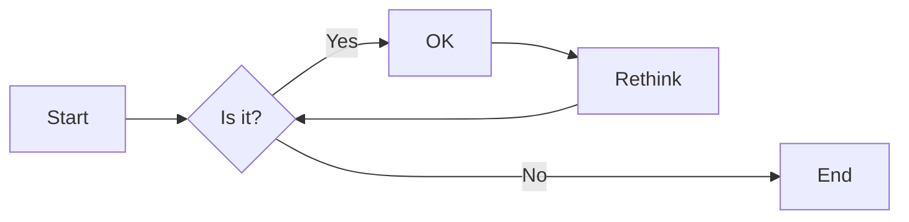

# 实验四 Python字典和while循环

班级： 21计科3

学号： 20210302302

姓名： 蒋俊杰

Github地址：<https://github.com/jiangjunjie666/python_study>

CodeWars地址：<https://www.codewars.com/users/jiangjunjie666>

---

## 实验目的

1. 学习Python字典
2. 学习Python用户输入和while循环

## 实验环境

1. Git
2. Python 3.10
3. VSCode
4. VSCode插件

## 实验内容和步骤

### 第一部分

Python列表操作

完成教材《Python编程从入门到实践》下列章节的练习：

- 第6章 字典
- 第7章 用户输入和while循环

---

### 第二部分

在[Codewars网站](https://www.codewars.com)注册账号，完成下列Kata挑战：

---

#### 第一题：淘气还是乖孩子（Naughty or Nice）

难度： 7kyu

圣诞老人要来镇上了，他需要你帮助找出谁是淘气的或善良的。你将会得到一整年的JSON数据，按照这个格式：

```python
{
    January: {
        '1': 'Naughty','2': 'Naughty', ..., '31': 'Nice'
    },
    February: {
        '1': 'Nice','2': 'Naughty', ..., '28': 'Nice'
    },
    ...
    December: {
        '1': 'Nice','2': 'Nice', ..., '31': 'Naughty'
    }
}
```

你的函数应该返回 "Naughty!"或 "Nice!"，这取决于在某一年发生的总次数（以较大者为准）。如果两者相等，则返回 "Nice！"。
代码提交地址：
<https://www.codewars.com/kata/5662b14e0a1fb8320a00005c>

---

#### 第二题： 观察到的PIN（The observed PIN）

难度：4kyu

好了，侦探，我们的一个同事成功地观察到了我们的目标人物，抢劫犯罗比。我们跟踪他到了一个秘密仓库，我们认为在那里可以找到所有被盗的东西。这个仓库的门被一个电子密码锁所保护。不幸的是，我们的间谍不确定他看到的密码，当罗比进入它时。

键盘的布局如下：

```python
┌───┬───┬───┐
│ 1 │ 2 │ 3 │
├───┼───┼───┤
│ 4 │ 5 │ 6 │
├───┼───┼───┤
│ 7 │ 8 │ 9 │
└───┼───┼───┘
    │ 0 │   
    └───┘
```

他注意到密码1357，但他也说，他看到的每个数字都有可能是另一个相邻的数字（水平或垂直，但不是对角线）。例如，代替1的也可能是2或4。而不是5，也可能是2、4、6或8。

他还提到，他知道这种锁。你可以无限制地输入错误的密码，但它们最终不会锁定系统或发出警报。这就是为什么我们可以尝试所有可能的（*）变化。

*可能的意义是：观察到的PIN码本身和考虑到相邻数字的所有变化。

你能帮助我们找到所有这些变化吗？如果有一个函数，能够返回一个列表，其中包含一个长度为1到8位的观察到的PIN的所有变化，那就更好了。我们可以把这个函数命名为getPINs（在python中为get_pins，在C#中为GetPINs）。

但请注意，所有的PINs，包括观察到的PINs和结果，都必须是字符串，因为有可能会有领先的 "0"。我们已经为你准备了一些测试案例。
侦探，我们就靠你了!
代码提交地址：
<https://www.codewars.com/kata/5263c6999e0f40dee200059d>

---

#### 第三题： RNA到蛋白质序列的翻译（RNA to Protein Sequence Translation）

难度：6kyu

蛋白质是由DNA转录成RNA，然后转译成蛋白质的中心法则。RNA和DNA一样，是由糖骨架（在这种情况下是核糖）连接在一起的长链核酸。每个由三个碱基组成的片段被称为密码子。称为核糖体的分子机器将RNA密码子转译成氨基酸链，称为多肽链，然后将其折叠成蛋白质。

蛋白质序列可以像DNA和RNA一样很容易地可视化，作为大字符串。重要的是要注意，“停止”密码子不编码特定的氨基酸。它们的唯一功能是停止蛋白质的转译，因此它们不会被纳入多肽链中。“停止”密码子不应出现在最终的蛋白质序列中。为了节省您许多不必要（和乏味）的键入，已为您的氨基酸字典提供了键和值。

给定一个RNA字符串，创建一个将RNA转译为蛋白质序列的函数。注意：测试用例将始终生成有效的字符串。

```python
protein（'UGCGAUGAAUGGGCUCGCUCC'）
```

将返回`CDEWARS`

作为测试用例的一部分是一个真实世界的例子！最后一个示例测试用例对应着一种叫做绿色荧光蛋白的蛋白质，一旦被剪切到另一个生物体的基因组中，像GFP这样的蛋白质可以让生物学家可视化细胞过程！

Amino Acid Dictionary

```python
   # Your dictionary is provided as PROTEIN_DICT
   PROTEIN_DICT = {
    # Phenylalanine
    'UUC': 'F', 'UUU': 'F',
    # Leucine
    'UUA': 'L', 'UUG': 'L', 'CUU': 'L', 'CUC': 'L', 'CUA': 'L', 'CUG': 'L',
    # Isoleucine
    'AUU': 'I', 'AUC': 'I', 'AUA': 'I',
    # Methionine
    'AUG': 'M',
    # Valine
    'GUU': 'V', 'GUC': 'V', 'GUA': 'V', 'GUG': 'V',
    # Serine
    'UCU': 'S', 'UCC': 'S', 'UCA': 'S', 'UCG': 'S', 'AGU': 'S', 'AGC': 'S',
    # Proline
    'CCU': 'P', 'CCC': 'P', 'CCA': 'P', 'CCG': 'P',
    # Threonine
    'ACU': 'T', 'ACC': 'T', 'ACA': 'T', 'ACG': 'T',
    # Alanine
    'GCU': 'A', 'GCC': 'A', 'GCA': 'A', 'GCG': 'A',
    # Tyrosine
    'UAU': 'Y', 'UAC': 'Y',
    # Histidine
    'CAU': 'H', 'CAC': 'H',
    # Glutamine
    'CAA': 'Q', 'CAG': 'Q',
    # Asparagine
    'AAU': 'N', 'AAC': 'N',
    # Lysine
    'AAA': 'K', 'AAG': 'K',
    # Aspartic Acid
    'GAU': 'D', 'GAC': 'D',
    # Glutamic Acid
    'GAA': 'E', 'GAG': 'E',
    # Cystine
    'UGU': 'C', 'UGC': 'C',
    # Tryptophan
    'UGG': 'W',
    # Arginine
    'CGU': 'R', 'CGC': 'R', 'CGA': 'R', 'CGG': 'R', 'AGA': 'R', 'AGG': 'R',
    # Glycine
    'GGU': 'G', 'GGC': 'G', 'GGA': 'G', 'GGG': 'G',
    # Stop codon
    'UAA': 'Stop', 'UGA': 'Stop', 'UAG': 'Stop'
}
```

代码提交地址：
<https://www.codewars.com/kata/555a03f259e2d1788c000077>

---

#### 第四题： 填写订单（Thinkful - Dictionary drills: Order filler）

难度：8kyu

您正在经营一家在线业务，您的一天中很大一部分时间都在处理订单。随着您的销量增加，这项工作占用了更多的时间，不幸的是最近您遇到了一个情况，您接受了一个订单，但无法履行。

您决定写一个名为`fillable()`的函数，它接受三个参数：一个表示您库存的字典`stock`，一个表示客户想要购买的商品的字符串`merch`，以及一个表示他们想购买的商品数量的整数n。如果您有足够的商品库存来完成销售，则函数应返回`True`，否则应返回`False`。

有效的数据将始终被传入，并且n将始终大于等于1。

代码提交地址：
<https://www.codewars.com/kata/586ee462d0982081bf001f07/python>

---

#### 第五题： 莫尔斯码解码器（Decode the Morse code, advanced）

难度： 4kyu

在这个作业中，你需要为有线电报编写一个莫尔斯码解码器。
有线电报通过一个有按键的双线路运行，当按下按键时，会连接线路，可以在远程站点上检测到。莫尔斯码将每个字符的传输编码为"点"（按下按键的短按）和"划"（按下按键的长按）的序列。

在传输莫尔斯码时，国际标准规定：

- "点" - 1个时间单位长。
- "划" - 3个时间单位长。
- 字符内点和划之间的暂停 - 1个时间单位长。
- 单词内字符之间的暂停 - 3个时间单位长。
- 单词间的暂停 - 7个时间单位长。

但是，该标准没有规定"时间单位"有多长。实际上，不同的操作员会以不同的速度进行传输。一个业余人士可能需要几秒钟才能传输一个字符，一位熟练的专业人士可以每分钟传输60个单词，而机器人发射器可能会快得多。

在这个作业中，我们假设消息的接收是由硬件自动执行的，硬件会定期检查线路，如果线路连接（远程站点的按键按下），则记录为1，如果线路未连接（远程按键弹起），则记录为0。消息完全接收后，它会以一个只包含0和1的字符串的形式传递给你进行解码。

例如，消息`HEYJUDE`，即`·····−·−−··−−−··−−··`可以如下接收：

```python
1100110011001100000011000000111111001100111111001111110000000000000011001111110011111100111111000000110011001111110000001111110011001100000011
```

如您所见，根据标准，这个传输完全准确，硬件每个"点"采样了两次。

因此，你的任务是实现两个函数：

函数decodeBits(bits)，应该找出消息的传输速率，正确解码消息为点（.）、划（-）和空格（字符之间有一个空格，单词之间有三个空格），并将它们作为一个字符串返回。请注意，在消息的开头和结尾可能会出现一些额外的0，确保忽略它们。另外，如果你无法分辨特定的1序列是点还是划，请假设它是一个点。

函数decodeMorse(morseCode)，它将接收上一个函数的输出，并返回一个可读的字符串。

注意：出于编码目的，你必须使用ASCII字符.和-，而不是Unicode字符。

莫尔斯码表已经预加载给你了（请查看解决方案设置，以获取在你的语言中使用它的标识符）。

```python
morseCodes(".--")  #to access the morse translation of ".--"
```

下面是Morse码支持的完整字符列表：

```javascript
A    ·–
B    –···
C    –·–·
D    –··
E    ·
F    ··–·
G    ––·
H    ····
I    ··
J    ·–––
K    –·–
L    ·–··
M    ––
N    –·
O    –––
P    ·––·
Q    ––·–
R    ·–·
S    ···
T    –
U    ··–
V    ···–
W    ·––
X    –··–
Y    –·––
Z    ––··
0    –––––
1    ·––––
2    ··–––
3    ···––
4    ····–
5    ·····
6    –····
7    ––···
8    –––··
9    ––––·
.    ·–·–·–
,    ––··––
?    ··––··
'    ·––––·
!    –·–·––
/    –··–·
(    –·––·
)    –·––·–
&    ·–···
:    –––···
;    –·–·–·
=    –···–
+    ·–·–·
-    –····–
_    ··––·–
"    ·–··–·
$    ···–··–
@    ·––·–·
```

代码提交地址：
<https://www.codewars.com/kata/decode-the-morse-code-advanced>

---

### 第三部分

使用Mermaid绘制程序流程图

安装VSCode插件：

- Markdown Preview Mermaid Support
- Mermaid Markdown Syntax Highlighting

使用Markdown语法绘制你的程序绘制程序流程图（至少一个），Markdown代码如下：


显示效果如下：



查看Mermaid流程图语法-->[点击这里](https://mermaid.js.org/syntax/flowchart.html)

使用Markdown编辑器（例如VScode）编写本次实验的实验报告，包括[实验过程与结果](#实验过程与结果)、[实验考查](#实验考查)和[实验总结](#实验总结)，并将其导出为 **PDF格式** 来提交。

## 实验过程与结果

请将实验过程与结果放在这里，包括：

- [第一部分 Python列表操作和if语句](#第一部分)
- [第二部分 Codewars Kata挑战](#第二部分)

##### 1.圣诞老人

```python
def naughty_or_nice(data):
    naughty_count = 0
    nice_count = 0
    for month in data:
        for day in data[month]:
            behavior = data[month][day]  # 获取每天的行为
            if behavior == 'Naughty':
                naughty_count += 1
            elif behavior == "Nice":
                nice_count += 1

    if (naughty_count > nice_count):
        return 'Naughty!'
    elif (naughty_count < nice_count):
        return 'Nice!'
    else:
        return 'Nice!'


# 用你提供的JSON数据调用这个函数
santa_data = {
    "January": {
        '1': 'Naughty', '2': 'Naughty', '31': 'Nice'
    },
    "February": {
        '1': 'Nice', '2': 'Naughty', '28': 'Nice'
    },
    "December": {
        '1': 'Nice', '2': 'Nice', '31': 'Naughty'
    }
}

result = naughty_or_nice(santa_data)
print(result)
```

##### 2.寻找Pin码

```python
    # 创建一个字典，用于存储每个数字对应的相邻数字
    adjacent_digits = {
        '0': ['0', '8'],
        '1': ['1', '2', '4'],
        '2': ['1', '2', '3', '5'],
        '3': ['2', '3', '6'],
        '4': ['1', '4', '5', '7'],
        '5': ['2', '4', '5', '6', '8'],
        '6': ['3', '5', '6', '9'],
        '7': ['4', '7', '8'],
        '8': ['5', '7', '8', '9', '0'],
        '9': ['6', '8', '9']
    }

    # 如果观察到的PIN码只有一位，直接返回相邻数字
    if len(observed) == 1:
        return adjacent_digits[observed]

    # 递归生成PIN码变化
    sub_pins = get_pins(observed[1:])
    observed_digit = observed[0]

    # 将观察到的数字与后续数字的变化组合
    result = [digit + sub for digit in adjacent_digits[observed_digit]
              for sub in sub_pins]

    return result
```

##### 3.RNA蛋白质

```python
def translate_rna_to_protein(rna):
    protein_sequence = ""
    i = 0

    while i < len(rna):
        codon = rna[i:i+3]  # 从RNA中获取三个碱基的密码子
        amino_acid = PROTEIN_DICT[codon]  # 使用字典查找对应的氨基酸

        if amino_acid == 'Stop':
            break  # 如果遇到停止密码子，停止翻译

        protein_sequence += amino_acid
        i += 3  # 移动到下一个密码子

    return protein_sequence


# 使用示例
rna_sequence = 'UGCGAUGAAUGGGCUCGCUCC'
protein_result = translate_rna_to_protein(rna_sequence)
print(protein_result)

```

##### 4.填写订单

```python
def fillable(stock, merch, n):
    if merch in stock and stock[merch] >= n:
        return True
    else:
        return False


stock = {
    'item1': 10,
    'item2': 5,
    'item3': 0
}

print(fillable(stock, 'item1', 5))  # 应返回 True
print(fillable(stock, 'item2', 7))  # 应返回 False
print(fillable(stock, 'item3', 1))  # 应返回 False
```

##### 5.莫尔斯编码

```python
import re

# 预加载的莫尔斯码表
morse_code_dict = {
    ".-": "A", "-...": "B", "-.-.": "C", "-..": "D", ".": "E",
    "..-.": "F", "--.": "G", "....": "H", "..": "I", ".---": "J",
    "-.-": "K", ".-..": "L", "--": "M", "-.": "N", "---": "O",
    ".--.": "P", "--.-": "Q", ".-.": "R", "...": "S", "-": "T",
    "..-": "U", "...-": "V", ".--": "W", "-..-": "X", "-.--": "Y",
    "--..": "Z", "-----": "0", ".----": "1", "..---": "2", "...--": "3",
    "....-": "4", ".....": "5", "-....": "6", "--...": "7", "---..": "8",
    "----.": "9", ".-.-.-": ".", "--..--": ",", "..--..": "?",
    ".----.": "'", "-.-.--": "!", "-..-.": "/", "-.--.": "(", "-.--.-": ")",
    ".-...": "&", "---...": ":", "-.-.-.": ";", "-...-": "=", ".-.-.": "+",
    "-....-": "-", ".-..-.": "_", ".-..-.": '"', "...-..-": "$", ".--.-.": "@"
}


def decodeBits(bits):
    # 删除前导和尾随的0
    bits = bits.strip('0')

    # 计算时间单位长度
    unit_length = min([len(match)
                      for match in bits.split('1') + bits.split('0')])

    # 构建正则表达式模式
    pattern = '1' * (3 * unit_length) + '0' * unit_length
    pattern += '|1' * unit_length + '0' * unit_length
    pattern += '|1' * (unit_length * 7) + '0' * unit_length
    pattern += '|0' * unit_length  # 用于匹配字符之间的空格

    # 通过正则表达式分割字符串
    parts = re.split(pattern, bits)

    morse_code = ''
    for part in parts:
        if part:
            morse_code += ' ' if len(part) > 3 * unit_length else ''
            morse_code += '.' if part[0] == '1' else '-'

    return morse_code


def decodeMorse(morseCode):
    words = morseCode.strip().split('   ')  # 用三个空格分割单词
    decoded_message = ''

    for word in words:
        characters = word.split()  # 用空格分割字符
        for character in characters:
            # 查找莫尔斯码对应的字母
            decoded_message += morse_code_dict.get(character, '')
        decoded_message += ' '  # 单词之间添加空格

    return decoded_message.strip()  # 去除前导和尾随空格


# 示例用法
bits = "1100110011001100000011000000111111001100111111001111110000000000000011001111110011111100111111000000110011001111110000001111110011001100000011"
morse_code = decodeBits(bits)
decoded_message = decodeMorse(morse_code)
print(decoded_message)
```

- [第三部分 使用Mermaid绘制程序流程图](#第三部分)

代码运行结果的文本可以直接粘贴在这里。

**注意：不要使用截图，Markdown文档转换为Pdf格式后，截图可能会无法显示。**

## 实验考查

请使用自己的语言并使用尽量简短代码示例回答下面的问题，这些问题将在实验检查时用于提问和答辩以及实际的操作。

1. 字典的键和值有什么区别？

###### 键（Key）

- 键是字典中的标识符，用于唯一标识每个值。
- 键通常是不可变的数据类型，例如字符串、数字、元组等，因为字典需要保证键的唯一性和不可变性。
- 键是字典中的索引，通过键可以查找和访问与之关联的值。
- 在同一个字典中，键必须是唯一的，不允许重复的键。

###### 值（Value）

- 值是与键相关联的数据，可以是任何数据类型，包括字符串、数字、列表、其他字典等。
- 值可以重复，不需要唯一性。
- 值可以是可变的数据类型，即可以包含可变的列表、字典等。

2. 在读取和写入字典时，需要使用默认值可以使用什么方法？

- 使用get()方法：
get()方法允许你尝试获取字典中的值，并在键不存在时提供一个默认值

```python
value = my_dict.get(key, default_value)
```

- 使用setdefault()方法：
setdefault()方法用于设置键的默认值，如果键不存在，则将默认值写入字典。

```python
value = my_dict.setdefault(key, default_value)
```

3. Python中的while循环和for循环有什么区别？

###### while循环

- while循环是一种基于条件的迭代结构。它会在条件为真（True）时重复执行循环体中的代码。
- 循环的条件在每次迭代之前被检查，如果条件仍然为真，循环将继续执行；如果条件为假，循循环终止。
- while循环通常用于当你不知道要迭代多少次时，或者需要在满足某个条件时重复执行一段代码。

```python
count = 0
while count < 5:
    print(count)
    count += 1
```

###### for循环

- for循环是一种迭代指定范围的元素的循环结构。它通常用于迭代容器（如列表、元组、字符串等）中的元素，或者使用range()等函数生成的数字序列。
- for循循环会自动遍历容器中的每个元素，不需要显式定义迭代条件。
- for循环是一种更常用的迭代结构，适用于知道要迭代多少次的情况。

```python
fruits = ['apple', 'banana', 'cherry']
for fruit in fruits:
    print(fruit)
```

4. 阅读[PEP 636 – Structural Pattern Matching: Tutorial](https://peps.python.org/pep-0636/), 总结Python 3.10中新出现的match语句的使用方法。

## 实验总结

总结一下这次实验你学习和使用到的知识，例如：编程工具的使用、数据结构、程序语言的语法、算法、编程技巧、编程思想。

编程工具的使用：我使用了Python编程语言和Jupyter Notebook作为编程工具。
数据结构：我使用了列表（list）来存储实验数据，并熟练掌握了列表的基本操作，如添加元素、删除元素、修改元素、查找元素等。
程序语言的语法：我掌握了Python编程语言的基本语法，如变量声明、条件语句、循环语句等。
算法：我掌握了冒泡排序算法、插入排序算法、快速排序算法等基本的排序算法，以及列表的逆序操作。
编程技巧：我掌握了列表的基本操作，以及如何使用循环和条件语句实现算法。
编程思想：我掌握了编程的基本思想，如模块化、面向对象编程等
